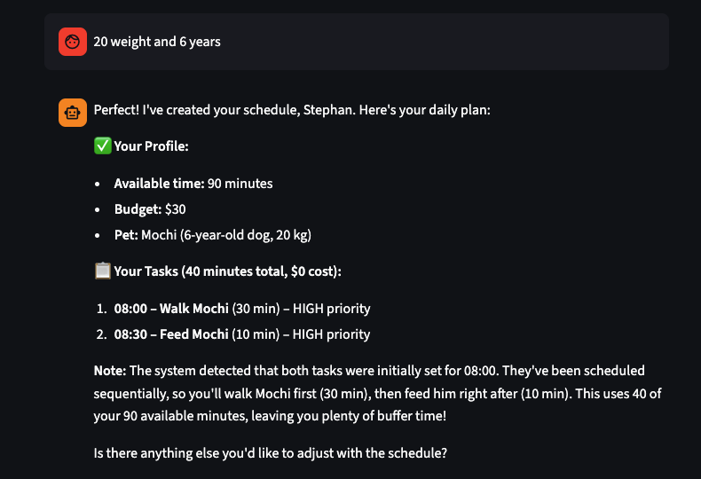
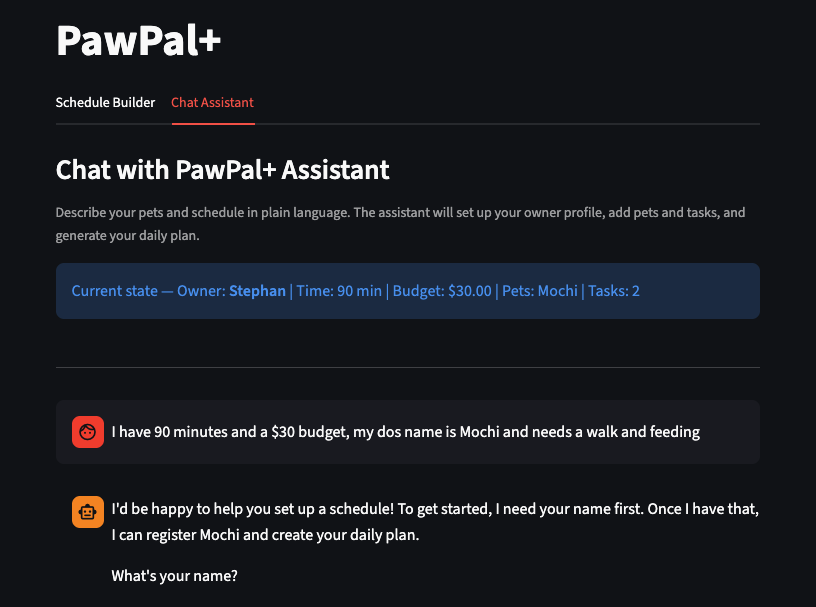

# PawPal+

**A pet care scheduling assistant — from rule-based scheduler to AI-powered conversational planner.**

---

## Original Project (Modules 1–3)

PawPal+ was originally built as a constraint-based daily planner for pet owners. The original goal was to let a user enter their available time and budget, register their pets, add care tasks (walks, feeding, medication, grooming, enrichment), and receive a prioritised daily schedule that fit within their constraints. The system used a greedy algorithm that sorted tasks by priority level (HIGH → MEDIUM → LOW) and filled the schedule one task at a time, skipping any that exceeded the remaining time or budget. It also detected time-slot conflicts and supported daily and weekly recurring tasks.

---

## What This Project Does (Module 4 Addition)

Module 4 extends PawPal+ with a **conversational AI agent** powered by the Anthropic Claude API. Instead of filling out forms, users can describe their pets and schedule in plain language. The agent interprets the request, calls the scheduling system's existing tools, and returns a plain-language summary of the plan.

**Why it matters:** Pet owners shouldn't need to understand priority levels or time formats — they should be able to say "I have 90 minutes today and my dog needs a walk and feeding" and get a working schedule back. The AI layer makes the existing scheduling logic accessible to anyone.

---

## Architecture Overview

The system has four layers that work together:

```
User (browser)
    │
    ▼
app.py  ──  Two tabs: the original form builder (Tab 1) and a new chat interface (Tab 2)
    │
    ▼
agent.py  ──  Agentic loop: sends user messages + tool schemas to Claude,
              executes tool calls, feeds results back, loops until done
    │
    ▼
pawpal_system.py  ──  Domain model: Owner, Pet, Task, Scheduler (unchanged from Modules 1–3)
    │
    ▼
Anthropic API  ──  claude-haiku-4-5 decides which tools to call and in what order
```

See [`ARCHITECTURE.md`](./ARCHITECTURE.md) for the full component diagram, data flow diagram, and guardrails table.

---

## Setup Instructions

### Prerequisites
- Python 3.10 or higher
- An [Anthropic API key](https://console.anthropic.com/)

### Steps

```bash
# 1. Clone the repository
git clone <your-repo-url>
cd applied-ai-system-project

# 2. Create and activate a virtual environment
python -m venv .venv
source .venv/bin/activate        # Windows: .venv\Scripts\activate

# 3. Install dependencies
pip install -r requirements.txt

# 4. Add your Anthropic API key to the .env file
# Open .env and replace the placeholder value:
#   ANTHROPIC_API_KEY=sk-ant-...
# The app loads this automatically via python-dotenv — never commit .env

# 5. Run the app
streamlit run app.py

# 6. Run the test suite
pytest

# 7. (Optional) Watch agent logs in a second terminal
tail -f pawpal_agent.log
```

---

## Sample Interactions

### Example 1 — Full setup in one message

**User:**
> I'm Alex, I have 2 hours today and a $40 budget. My dog Bruno is 5 years old and weighs 22kg. Add a 30-minute morning walk at 7am (high priority) and a feeding at 8am (15 min, high priority). Then generate my schedule.

**Assistant:**
> Done! Here's what I set up:
>
> - Owner **Alex** saved (120 min available, $40.00 budget)
> - Pet **Bruno** added (dog, age 5, 22.0 kg)
> - Task **Morning walk** added for Bruno (30 min, HIGH, 07:00)
> - Task **Feeding** added for Bruno (15 min, HIGH, 08:00)
>
> **Daily Schedule:**
> | Time  | Task         | Duration | Priority |
> |-------|-------------|----------|----------|
> | 07:00 | Morning walk | 30 min   | High     |
> | 08:00 | Feeding      | 15 min   | High     |
>
> 2 tasks planned, 45 minutes total, $0.00 cost. No time conflicts — your schedule is clear.

---

### Example 2 — Constraint trimming

**User:**
> I only have 30 minutes today. Add a 20-minute walk (high priority, 8am), a 15-minute grooming session (medium priority, 9am), and a 10-minute feeding (high priority, 8:30am) for my cat Luna.

**Assistant:**
> I've added all three tasks for Luna. Here's the schedule with your 30-minute limit applied:
>
> **Scheduled (30 min total):**
> - 08:00 — Morning walk (20 min, HIGH)
> - 08:30 — Feeding (10 min, HIGH)
>
> **Skipped:**
> - Grooming (15 min, MEDIUM) — did not fit within the remaining time after higher-priority tasks were placed.
>
> Also note: Walk (08:00–08:20) and Feeding (08:30) don't overlap, so no conflicts.

---

### Example 3 — Off-topic guardrail

**User:**
> Can you help me write a cover letter?

**Assistant:**
> That's outside what I can help with! I'm PawPal+, a pet care scheduling assistant. I can help you set up an owner profile, register your pets, add care tasks, and generate a daily schedule.
>
> Would you like to get started? Just tell me your name, how much time you have today, and a little about your pet.

---

### Example 4 — Checking what's been set up

**User:**
> What pets do I have registered?

**Assistant:**
> You currently have 1 pet registered:
> - **Bruno** (dog, age 5, 22.0 kg)
>
> Would you like to add another pet or start adding tasks?

---

## Design Decisions

### Why an agentic workflow instead of RAG or fine-tuning?

The original scheduler already had a well-defined domain model and scheduling logic. The main problem was usability — the form-based UI was overwhelming. An agentic approach let us keep all existing logic intact and simply expose it as tools the AI can call. RAG would require a knowledge base we didn't have; fine-tuning would be unnecessary for a problem that doesn't require new factual knowledge.

### Why `claude-haiku-4-5`?

Haiku is fast, cheap, and sufficient for structured tool calling with a small, well-defined tool set. The scheduling decisions are made by `pawpal_system.py` — Claude only needs to understand user intent and map it to tool calls, which Haiku handles reliably. Opus or Sonnet would cost 3–5× more for no measurable benefit on this task.

### Trade-offs

| Decision | Benefit | Cost |
|---|---|---|
| Haiku over Opus | Low cost, fast response | Slightly less nuanced understanding of ambiguous inputs |
| Manual loop | Full observability | More code to maintain |
| `owner_ref` list pattern | Agent can create/update the owner object | Slightly unusual Python pattern |
| Both tabs share session state | Consistent view of data | A bug in one tab's state management could affect the other |
| Scope guardrail in system prompt | Keeps the agent focused | Claude may occasionally be overly cautious about borderline inputs |

---

## Testing Summary

### What the existing tests cover

The 14 tests in `tests/test_pawpal.py` verify the domain model directly:

| Area | Tests |
|---|---|
| Task completion and status change | 1 |
| Sorting by time (including 5-task scrambled input) | 2 |
| Filtering by status and by pet | 2 |
| Daily and weekly recurrence (attribute preservation) | 3 |
| Non-recurring task returns None | 1 |
| Owner re-queues next occurrence | 1 |
| Conflict detection (overlap, exact duplicate, no-false-positive) | 3 |
| Pet task tracking | 1 |

All 14 pass. These tests run against `pawpal_system.py` independently of the AI layer, which means the scheduling logic is verified even if the Claude API is unavailable or returns unexpected output.

### What worked

- The greedy scheduler is predictable and easy to reason about — the tests confirmed it behaves exactly as expected across all edge cases.

### What was harder than expected

- Getting the conversation history format right for multi-turn tool use — the messages list must include full `response.content` blocks (not just text strings) to preserve `tool_use` block IDs for the `tool_result` responses.

---

## Reflection

Building this project taught me that **AI is most useful when it wraps a system that already works well, not when it replaces one.** Adding the agent on top was fast precisely because the underlying system was solid — the AI just needed to know what tools existed and how to call them.

The second thing I learned is that **guardrails are not optional afterthoughts.** Inputs from a language model can be unexpected: a numeric field might arrive as a float when you expected an int, a string might contain control characters, and a confident-sounding tool call might reference a pet that doesn't exist yet.

Finally, working with an agentic loop made me think differently about debugging. In a normal program, you trace a call stack. In an agent, you trace a conversation — each tool call and result is a message in a list, and the log file becomes your primary debugging tool. Structured logging wasn't just nice to have, it was the only way to understand why the agent made a particular sequence of decisions.

---

## Project Structure

```
applied-ai-system-project/
├── app.py                  # Streamlit UI (Tab 1: forms, Tab 2: chat)
├── agent.py                # Agent loop, tool definitions, tool executor, guardrails
├── pawpal_system.py        # Domain model: Owner, Pet, Task, Schedule, Scheduler
├── tests/
│   └── test_pawpal.py      # 14 pytest tests for the domain model
├── ARCHITECTURE.md         # System diagram and data flow
├── requirements.txt        # streamlit, pytest, anthropic, python-dotenv
├── .env                    # API key (not committed)
├── pawpal_agent.log        # Runtime log (generated when the app runs)
└── README.md               # This file
```

---

## Demo

<a href="./assets/testcase.png" target="_blank"></a>

<a href="./assets/testcase2.png" target="_blank"></a>

---

## Video Walkthrough

[Watch the full walkthrough on Loom](https://www.loom.com/share/780b48cae5fb4579a466cb7a3c690676)
